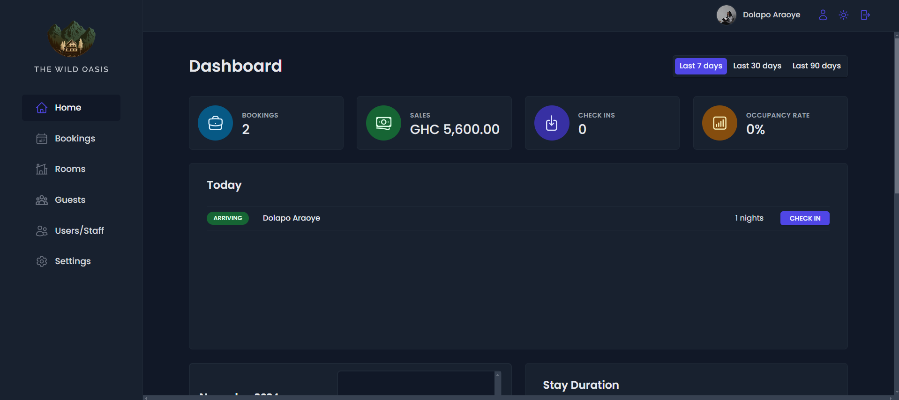

# Wild Oasis Hotel Management System



An admin-only hotel management and reservation system designed to streamline operations for reservations, bookings, and inventory management.

## Features

- **Reservation and Booking**: Book rooms and make reservations for guests.
- **Activity Reports**: Generate reports for activities based on selected dates.
- **Room Inventory Management**: Upload and manage room inventory.
- **Dashboard Analytics**: View analytics and sales data through an intuitive dashboard.

## Live Demo

[Wild Oasis Hotel Management System](https://hotel-management-system-ochre.vercel.app/)

## Technology Stack

- **Frontend**: Vite, React, React Router, Styled Components
- **Backend**: Supabase (Database and Authentication)
- **State Management**: React Query

## Getting Started

### Prerequisites

Ensure you have the following installed:

- [Node.js](https://nodejs.org/)
- [npm](https://www.npmjs.com/)

### Installation

1. Clone the repository:

   ```bash
   git clone https://github.com/your-repo/wild-oasis.git
   cd wild-oasis

   ```

2. Install dependencies:

   ```bash
   npm install

   ```

3. Start the development server:

   ```bash
    npm run dev
   ```

### Future Improvements

- Develop a customer-facing web application to allow customers to:
- Book rooms and make reservations directly.
- Use an integrated payment gateway for secure transactions.

### License

This project does not use any license
